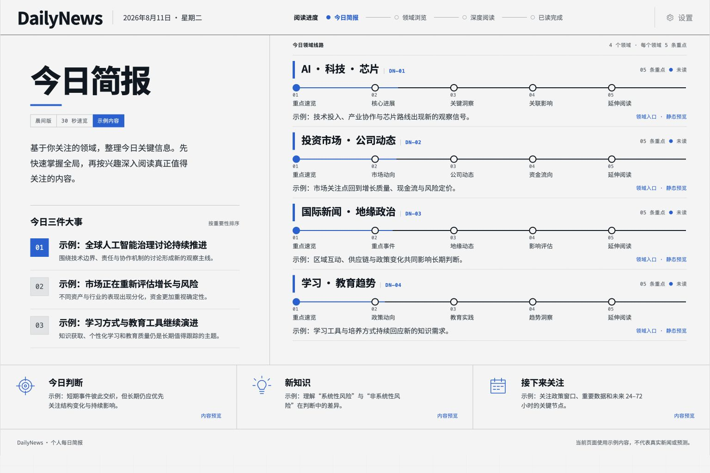
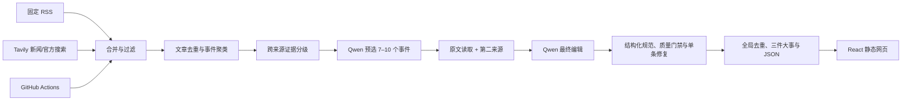

# DailyNews

[](https://github.com/Allennb666/dailynews-briefing/actions/workflows/ci.yml)
[](https://allennb666.github.io/dailynews-briefing/)
[](LICENSE)
[](https://react.dev/)
[](https://www.typescriptlang.org/)

一个面向中文读者的个人每日新闻简报。DailyNews 从公开 RSS、动态新闻搜索和官方网站定向搜索发现新闻，经过事件聚类、主动补充第二来源、Qwen 预选、公开原文读取、最终编辑和程序质量门禁，将当天值得关注的信息整理成一张适合先扫读、再深读的“晨间调度单”。



## 在线预览

访问 [DailyNews GitHub Pages](https://allennb666.github.io/dailynews-briefing/) 查看最新发布版本。

公开网站只读取已经生成的静态 JSON，不会在浏览器中携带或调用搜索或模型密钥。Tavily 和 Qwen 调用只发生在 GitHub Actions 的生成任务中；生成完成后，Pages 工作流会重新构建并发布网站。

## 功能亮点

- **四个固定领域**：AI／科技／芯片、投资市场／公司动态、国际新闻／地缘政治、学习／教育趋势。
- **每日 20 条重点**：每个领域稳定输出 5 条，不足时停止生成，不用虚构或过期内容补位。
- **可追溯的深度阅读**：保留来源、发布时间、原文链接、来源类型、置信度和采集提醒。
- **结构化分析**：提供事实梳理、背景逻辑、影响链、受影响对象、不确定性、术语解释、短中期趋势和验证信号。
- **Qwen 双阶段编辑**：`qwen3.5-27b` 先预选事件，再在补充原文和第二来源后完成最终写作。
- **硬性质量门禁**：来源、证据、中文完整性、事实链接和条件式预测由程序规范化并验证；单条失败时定向修复或替换候选，严重问题才保留上一期。
- **同日搜索复用**：一次运行完成的 Tavily 查询会保存为当天缓存；同日因编辑问题重跑时直接复用，不重复消耗搜索额度。
- **自动更新**：GitHub Actions 每天定时生成简报、验证项目并提交新的 JSON 数据。
- **响应式阅读体验**：桌面端和移动端均可完整阅读，并支持减少动态效果的系统偏好。

## 工作方式



项目没有常驻 API 服务或数据库。RSS 抓取和模型调用只发生在 Node.js 生成脚本中；浏览器仅加载 `public/data/briefings/daily-latest.json`，不会接触模型密钥。

## 快速开始

### 环境要求

- Node.js 22
- npm 10 或更高版本
- 生成最新简报时需要能够访问配置的 RSS 来源

### 查看仓库内已有简报

```bash
npm ci
npm run dev
```

打开终端显示的本地地址即可。此方式不会调用模型，也不会重新抓取新闻。

### 生成最新简报

```bash
cp .env.example .env
npm run briefing:generate
npm run dev
```

将 Qwen 和 Tavily 密钥只填写在本地 `.env`。没有 Tavily Key 时会自动退回 RSS；没有 Qwen 或最终稿严重不合格时会明确降级并保留上一期，不会发布成正常深度简报。

## 模型配置

只在本地 `.env` 或 GitHub Actions Secrets 中保存密钥。不要将密钥写入前端、README、工作流正文或任何会提交的 JSON 文件。

| 变量 | 用途 | 默认值 |
| --- | --- | --- |
| `AI_PROVIDER` | `qwen`、`auto` 或 `rules` | `qwen` |
| `DASHSCOPE_API_KEY` | Qwen / DashScope 密钥 | 空 |
| `QWEN_MODEL` | Qwen 模型名称 | `qwen3.5-27b` |
| `QWEN_BASE_URL` | Qwen 的 OpenAI 兼容接口地址 | DashScope 兼容接口 |
| `NEWS_SEARCH_PROVIDER` | 新闻搜索 Provider | `tavily` |
| `TAVILY_API_KEY` | Tavily Basic Search 密钥 | 空 |
| `DAILY_SEARCH_LIMIT` | 单次每日运行搜索硬上限 | `32` |
| `DISCOVERY_QUERIES_PER_DOMAIN` | 每领域发现查询数，最大 6 | `6` |
| `SECOND_SOURCE_EVENT_LIMIT` | 主动补第二来源的事件数，最大 8 | `8` |
| `ARTICLE_FETCH_LIMIT` | 公开原文读取数，最大 30 | `30` |

`auto` 与 `qwen` 都只会使用现有 Qwen 配置，不会切换到其他生成模型。预选失败可以规则降级。最终编辑使用稳定的来源 ID 和结构化条件预测，程序负责映射真实 URL；单条门禁失败时只修复该条，仍失败则从剩余候选替换，无法得到合格结果才停止本期发布。

模型连接使用兼容 OpenAI Chat Completions 的 `/chat/completions` 接口。建议在运行前确认账号可用的模型名称和接口地址。

## 常用命令

| 命令 | 作用 |
| --- | --- |
| `npm run dev` | 启动本地开发服务器 |
| `npm run briefing:generate` | 抓取 RSS 并生成四领域简报 |
| `npm test` | 运行采集和排序管线测试 |
| `npm run build` | 运行 TypeScript 检查并构建生产版本 |
| `npm run preview` | 本地预览生产构建 |

## 数据输出

生成任务会同时写入网页所需的“最新一期”和可追溯的“每日归档”：

| 路径 | 内容 |
| --- | --- |
| `public/data/briefings/daily-latest.json` | 网页读取的四领域最新一期 |
| `public/data/briefings/<domain>-latest.json` | 单个领域最新一期 |
| `data/briefings/YYYY-MM-DD-daily.json` | 四领域每日归档 |
| `data/briefings/YYYY-MM-DD-<domain>.json` | 单个领域每日归档 |

数据结构版本、新闻字段和趋势字段定义在 `shared/briefing.ts`。如任一领域少于 5 条合格新闻，生成任务会失败并保留上一期数据。

## 新闻来源与筛选

当前配置了 31 个公开 RSS 来源，包括机构官方源和专业媒体。各领域使用独立的时间窗口、主题词、影响词、标签规则和来源权重，配置集中在 `server/sources.ts`。

筛选管线会：

1. 清理摘要、日期和跟踪参数；
2. 按领域时间窗口和相关性过滤；
3. 结合来源权重、时效、影响关键词和信息完整度评分；
4. 使用规范化标题和词元相似度完成文章级去重；
5. 综合标题、摘要、实体、事件动作和 72 小时时间邻近度，把多篇报道聚合为 Event；
6. 按 `primary`、`tier-1`、`tier-2`、`other` 区分来源可靠性，并计算 `confirmed`、`corroborated`、`single-source`、`unverified` 证据等级；
7. Qwen 从每领域最多 60 个事件中预选 7–10 个，只输出 ID 和理由；
8. 最多读取 30 篇公开原文，并为全局最重要的 8 个事件主动搜索第二来源；
9. Qwen 最终选择和写作；程序将来源 ID 映射为真实 URL、规范化条件式预测，再执行来源、证据、中文、事实链接和预测信号等硬性门禁；
10. 四领域完成后跨领域去重，重新选择真正的今日三件大事并生成当天主线。

Tavily 查询结果保存在 GitHub Actions 的同日缓存中。首次运行仍受 32 次硬上限约束；如果当天只是编辑或门禁失败，重新运行会使用已完成的缓存查询，不会再次发起 Tavily 请求。缓存按北京时间日期隔离，不跨天复用旧新闻。

## 自动化更新

`.github/workflows/daily-briefing.yml` 支持手动触发，并计划在每天北京时间 **07:30** 左右运行。工作流会依次执行：

1. 安装锁定依赖；
2. 运行测试；
3. 恢复当日搜索缓存并生成简报；
4. 运行生产构建；
5. 仅在数据发生变化时提交最新简报和每日归档。

即使生成阶段未通过质量门禁，工作流也会先保存当天搜索缓存再结束；之后的同日重跑可以继续编辑而不重复搜索。

在仓库 **Settings → Secrets and variables → Actions** 中配置 `DASHSCOPE_API_KEY` 和 `TAVILY_API_KEY`。使用自定义 Qwen 兼容接口时，将地址保存为 `QWEN_BASE_URL` Secret；未配置时使用 DashScope 默认接口。密钥不要粘贴到聊天、代码或 JSON。同时需要在 **Actions → General → Workflow permissions** 中允许工作流写入仓库。

## 部署

这是标准 Vite 静态项目，可部署到 Vercel、Netlify、Cloudflare Pages 或其他静态托管平台：

- 构建命令：`npm run build`
- 输出目录：`dist`
- 推荐 Node.js：22

自动化生成的新 JSON 提交到默认分支后，连接该仓库的部署平台可以自动发布新版本。

仓库内置 `.github/workflows/pages.yml`，会在人工推送 `main`、手动触发，以及每日简报生成任务成功完成后部署 GitHub Pages。

## 项目结构

```text
DailyNews/
├── src/                     # React 页面与样式
├── server/                  # RSS 采集、筛选、模型分析与生成脚本
├── shared/                  # 前后端共享的数据类型
├── public/data/briefings/   # 网页读取的最新简报
├── data/briefings/          # 每日历史归档
├── artifacts/screenshots/   # README 与发布截图
├── .github/workflows/       # CI 与每日生成任务
├── PRODUCT.md               # 产品定位与原则
└── DESIGN.md                # 视觉系统与交互规范
```

## 质量边界

- RSS 用于发现和整理，事实应以每条新闻链接的原始来源为准。
- 来源可靠性与事件证据是两套指标：一手来源不自动等于事件已确认，证据等级取决于是否有独立可靠来源交叉印证。
- 模型只能从采集到的标题、摘要与来源材料中整理具体事实。
- 分析可以解释稳定的一般机制，但必须明确不确定性。
- 趋势预测必须使用条件判断，并给出后续可验证信号。
- 项目内容不构成投资、法律或其他专业建议。

## 安全

- `.env*`、本地工具状态、构建产物和依赖目录不会进入 Git。
- `.env.example` 只保留空占位符和公开配置。
- 提交前建议运行敏感信息扫描，并检查 `git status --ignored`。
- 如果密钥曾进入提交历史，应立即撤销并重新生成；仅删除文件不足以消除泄漏。

安全问题请不要公开披露密钥或个人数据，可通过 GitHub 仓库的私密漏洞报告功能联系维护者。

## 路线图

- 将长期历史归档迁移到数据库或对象存储；
- 增加历史查询、已读状态和个性化领域；
- 增加前端组件测试和端到端测试；
- 为新闻来源健康度和自动生成结果增加监控。

## License

代码以 [MIT License](LICENSE) 发布。新闻标题、摘要、商标和链接仍归其原始来源及相应权利人所有。
