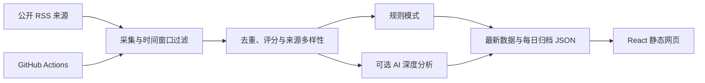

# DailyNews

[](https://github.com/Allennb666/dailynews-briefing/actions/workflows/ci.yml)
[](https://allennb666.github.io/dailynews-briefing/)
[](LICENSE)
[](https://react.dev/)
[](https://www.typescriptlang.org/)

一个面向中文读者的个人每日新闻简报。DailyNews 从公开 RSS 发现新闻，经过时效与相关性过滤、相似标题去重、来源多样性排序和可选的 AI 深度分析，将当天值得关注的信息整理成一张适合先扫读、再深读的“晨间调度单”。


## 在线预览

访问 [DailyNews GitHub Pages](https://allennb666.github.io/dailynews-briefing/) 查看最新发布版本。

公开网站只读取已经生成的静态 JSON，不会在浏览器中携带或调用模型密钥。Qwen、DeepSeek 或 OpenAI 调用发生在 GitHub Actions 的生成任务中；生成完成后，Pages 工作流会重新构建并发布网站。

## 功能亮点

- **四个固定领域**：AI／科技／芯片、投资市场／公司动态、国际新闻／地缘政治、学习／教育趋势。
- **每日 20 条重点**：每个领域稳定输出 5 条，不足时停止生成，不用虚构或过期内容补位。
- **可追溯的深度阅读**：保留来源、发布时间、原文链接、来源类型、置信度和采集提醒。
- **结构化分析**：提供事实梳理、背景逻辑、影响链、受影响对象、不确定性、术语解释、短中期趋势和验证信号。
- **规则与多模型模式**：无密钥时可使用免费的规则模式；也可接入 Qwen、DeepSeek 或 OpenAI。
- **自动更新**：GitHub Actions 每天定时生成简报、验证项目并提交新的 JSON 数据。
- **响应式阅读体验**：桌面端和移动端均可完整阅读，并支持减少动态效果的系统偏好。

## 工作方式



项目没有常驻 API 服务或数据库。RSS 抓取和模型调用只发生在 Node.js 生成脚本中；浏览器仅加载 `public/data/briefings/daily-latest.json`，不会接触模型密钥。

## 快速开始

### 环境要求

- Node.js 22
- npm 10 或更高版本
- 生成最新简报时需要能够访问配置的 RSS 来源

### 查看仓库内已有简报

```bash
npm ci
npm run dev
```

打开终端显示的本地地址即可。此方式不会调用模型，也不会重新抓取新闻。

### 生成最新简报

```bash
cp .env.example .env
npm run briefing:generate
npm run dev
```

`.env.example` 默认使用 `rules`，不会产生模型费用。规则模式仍会访问公开 RSS，但不会向任何模型服务发送内容。

## 模型配置

只在本地 `.env` 或 GitHub Actions Secrets 中保存密钥。不要将密钥写入前端、README、工作流正文或任何会提交的 JSON 文件。

| 变量 | 用途 | 默认值 |
| --- | --- | --- |
| `AI_PROVIDER` | `rules`、`auto`、`qwen`、`deepseek` 或 `openai` | `rules`（示例配置） |
| `DASHSCOPE_API_KEY` | Qwen / DashScope 密钥 | 空 |
| `QWEN_MODEL` | Qwen 模型名称 | `qwen3.5-27b` |
| `QWEN_BASE_URL` | Qwen 的 OpenAI 兼容接口地址 | DashScope 兼容接口 |
| `DEEPSEEK_API_KEY` | DeepSeek 密钥 | 空 |
| `DEEPSEEK_MODEL` | DeepSeek 模型名称 | `deepseek-chat` |
| `OPENAI_API_KEY` | OpenAI API 密钥 | 空 |
| `OPENAI_MODEL` | OpenAI 模型名称 | 见 `.env.example` |

`auto` 会按 Qwen → DeepSeek → OpenAI 的顺序使用第一个已配置密钥。每个领域单独调用模型；某个领域失败时会回退到规则模式并记录提醒，不影响其他领域。

模型连接使用兼容 OpenAI Chat Completions 的 `/chat/completions` 接口。建议在运行前确认账号可用的模型名称和接口地址。

## 常用命令

| 命令 | 作用 |
| --- | --- |
| `npm run dev` | 启动本地开发服务器 |
| `npm run briefing:generate` | 抓取 RSS 并生成四领域简报 |
| `npm test` | 运行采集和排序管线测试 |
| `npm run build` | 运行 TypeScript 检查并构建生产版本 |
| `npm run preview` | 本地预览生产构建 |

## 数据输出

生成任务会同时写入网页所需的“最新一期”和可追溯的“每日归档”：

| 路径 | 内容 |
| --- | --- |
| `public/data/briefings/daily-latest.json` | 网页读取的四领域最新一期 |
| `public/data/briefings/<domain>-latest.json` | 单个领域最新一期 |
| `data/briefings/YYYY-MM-DD-daily.json` | 四领域每日归档 |
| `data/briefings/YYYY-MM-DD-<domain>.json` | 单个领域每日归档 |

数据结构版本、新闻字段和趋势字段定义在 `shared/briefing.ts`。如任一领域少于 5 条合格新闻，生成任务会失败并保留上一期数据。

## 新闻来源与筛选

当前配置了 31 个公开 RSS 来源，包括机构官方源和专业媒体。各领域使用独立的时间窗口、主题词、影响词、标签规则和来源权重，配置集中在 `server/sources.ts`。

筛选管线会：

1. 清理摘要、日期和跟踪参数；
2. 按领域时间窗口和相关性过滤；
3. 结合来源权重、时效、影响关键词和信息完整度评分；
4. 使用规范化标题和词元相似度去重；
5. 默认限制同一来源最多入选 2 条；
6. 选出 5 条重点，并保留无法获取的来源提醒。

## 自动化更新

`.github/workflows/daily-briefing.yml` 支持手动触发，并计划在每天北京时间 **06:10** 运行。工作流会依次执行：

1. 安装锁定依赖；
2. 运行测试；
3. 生成当天简报；
4. 运行生产构建；
5. 仅在数据发生变化时提交最新简报和每日归档。

启用模型时，在仓库 **Settings → Secrets and variables → Actions** 中配置 `DASHSCOPE_API_KEY`、`DEEPSEEK_API_KEY` 或 `OPENAI_API_KEY`。使用自定义 Qwen 兼容接口时，将地址保存为 `QWEN_BASE_URL` Secret；未配置时使用 DashScope 默认接口。同时需要在 **Actions → General → Workflow permissions** 中允许工作流写入仓库。

## 部署

这是标准 Vite 静态项目，可部署到 Vercel、Netlify、Cloudflare Pages 或其他静态托管平台：

- 构建命令：`npm run build`
- 输出目录：`dist`
- 推荐 Node.js：22

自动化生成的新 JSON 提交到默认分支后，连接该仓库的部署平台可以自动发布新版本。

仓库内置 `.github/workflows/pages.yml`，会在人工推送 `main`、手动触发，以及每日简报生成任务成功完成后部署 GitHub Pages。

## 项目结构

```text
DailyNews/
├── src/                     # React 页面与样式
├── server/                  # RSS 采集、筛选、模型分析与生成脚本
├── shared/                  # 前后端共享的数据类型
├── public/data/briefings/   # 网页读取的最新简报
├── data/briefings/          # 每日历史归档
├── artifacts/screenshots/   # README 与发布截图
├── .github/workflows/       # CI 与每日生成任务
├── PRODUCT.md               # 产品定位与原则
└── DESIGN.md                # 视觉系统与交互规范
```

## 质量边界

- RSS 用于发现和整理，事实应以每条新闻链接的原始来源为准。
- 官方源默认置信度高，专业媒体默认置信度中；这不是独立事实核查评级。
- 模型只能从采集到的标题、摘要与来源材料中整理具体事实。
- 分析可以解释稳定的一般机制，但必须明确不确定性。
- 趋势预测必须使用条件判断，并给出后续可验证信号。
- 项目内容不构成投资、法律或其他专业建议。

## 安全

- `.env*`、本地工具状态、构建产物和依赖目录不会进入 Git。
- `.env.example` 只保留空占位符和公开配置。
- 提交前建议运行敏感信息扫描，并检查 `git status --ignored`。
- 如果密钥曾进入提交历史，应立即撤销并重新生成；仅删除文件不足以消除泄漏。

安全问题请不要公开披露密钥或个人数据，可通过 GitHub 仓库的私密漏洞报告功能联系维护者。

## 路线图

- 建立真正的跨领域全局重要性排序；
- 将长期历史归档迁移到数据库或对象存储；
- 增加历史查询、已读状态和个性化领域；
- 增加前端组件测试和端到端测试；
- 为新闻来源健康度和自动生成结果增加监控。

## License

代码以 [MIT License](LICENSE) 发布。新闻标题、摘要、商标和链接仍归其原始来源及相应权利人所有。
